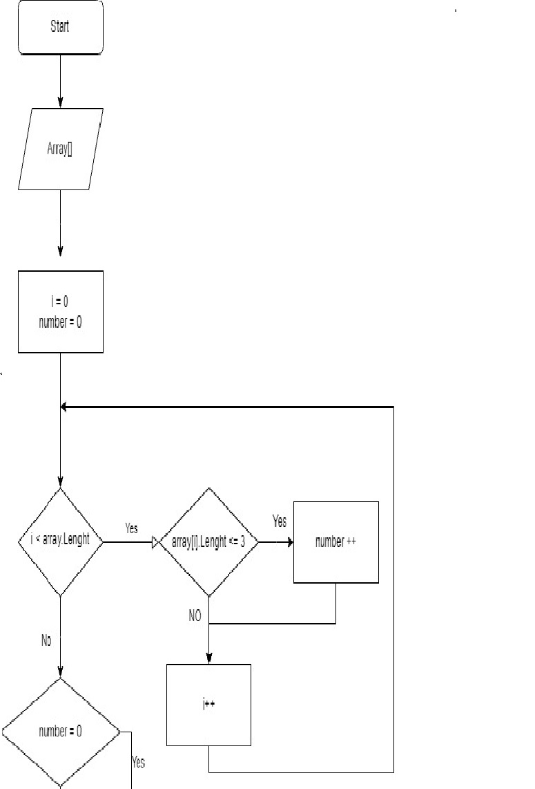

**Итоговая контрольная работа по основному блоку**

Контрольная работа необходима для проверки знаний и навыков по итогу прохождения первого блока обучения на программе Разработчик. 

*Для выполнения проверочной работы выполнено:*

* Создан репозиторий на GitHub

* Нарисована блок-схема алгоритма 

* Написана программа, решающая поставленную задачу.
